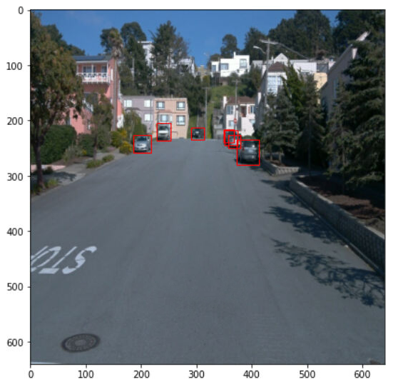

# Object Detection in an Urban Environment

## Project overview
In this project it was created a convolutional neural network that allows to detect and classify objects in the urban environments (i.e. cyclists, pedestrians and vehicles) using the annotated data from Waymo.

First, it was be performed an extensive data analysis including the computation of label distributions, display of sample images, and checking for object occlusions. This analysis has been used to decide what augmentations are meaningful for this project. 

Then, a neural network was trained to detect and classify objects. The monitoring of the training was done with TensorBoard. 

Finally, it was experimented with different hyperparameters to improve your model's performance.#

This project has made use of the TensorFlow Object Detection API, where the model was deployed to get predictions on images sent to the API. Additionaly a short video of their model predictions was created to demonstrate the results.

## Data

For this project, we will be using data from the [Waymo Open dataset](https://waymo.com/open/).

[OPTIONAL] - The files can be downloaded directly from the website as tar files or from the [Google Cloud Bucket](https://console.cloud.google.com/storage/browser/waymo_open_dataset_v_1_2_0_individual_files/) as individual tf records. We have already provided the data required to finish this project in the workspace, so you don't need to download it separately.

## Structure

### Data

The data you will use for training, validation and testing is organized as follow:
```
/home/workspace/data
	- training_and_validation - contains 97 files to train and validate your models
    - train: contain the train data (empty to start)
    - val: contain the val data (empty to start)
    - test - contains 3 files to test your model and create inference videos
```
The `training_and_validation` folder contains file that have been downsampled: we have selected one every 10 frames from 10 fps videos. The `testing` folder contains frames from the 10 fps video without downsampling.

You will split this `training_and_validation` data into `train`, and `val` sets by completing and executing the `create_splits.py` file.


### Experiments
The experiments folder will be organized as follow:
```
experiments/
    - pretrained_model/
    - exporter_main_v2.py - to create an inference model
    - model_main_tf2.py - to launch training
    - reference/ - reference training with the unchanged config file
    - experiment0/ - create a new folder for each experiment you run
    - experiment1/ - create a new folder for each experiment you run
    - experiment2/ - create a new folder for each experiment you run
    - label_map.pbtxt
    ...
```

## Prerequisites

### Local Setup

For local setup if you have your own Nvidia GPU, you can use the provided Dockerfile and requirements in the [build directory](./build).

Follow [the README therein](./build/README.md) to create a docker container and install all prerequisites.

### Download and process the data

**Note:** ”I was using the classroom workspace, so I used the downloaded and processed files within the `/home/workspace/data/preprocessed_data/` directory. Check this out before proceeding to the **Exploratory Data Analysis** part.

The first goal of this project is to download the data from the Waymo's Google Cloud bucket to your local machine. For this project, we only need a subset of the data provided (for example, we do not need to use the Lidar data). Therefore, we are going to download and trim immediately each file. In `download_process.py`, you can view the `create_tf_example` function, which will perform this processing. This function takes the components of a Waymo Tf record and saves them in the Tf Object Detection api format. An example of such function is described [here](https://tensorflow-object-detection-api-tutorial.readthedocs.io/en/latest/training.html#create-tensorflow-records). We are already providing the `label_map.pbtxt` file.

You can run the script using the following command:
```
python download_process.py --data_dir {processed_file_location} --size {number of files you want to download}
```

You are downloading 100 files (unless you changed the `size` parameter) so be patient! Once the script is done, you can look inside your `data_dir` folder to see if the files have been downloaded and processed correctly.

### Classroom Workspace

In the classroom workspace, every library and package should already be installed in your environment. You will NOT need to make use of `gcloud` to download the images.

## Instructions

### Exploratory Data Analysis

Here I want to share the results of exploring the dataset using the `display_instances` function to display images and annotations using `matplotlib`. 


|   |   |
:-------------------------:|:-------------------------:
|   |   |

It was observed that a lot of images were done at night, fog or rain. 

I also took a sample of 20.000 images and analysed their distribusion from different angles.

It was observed a dominance of car tags in the sample. Pedestrians are met a few times more rare in the dataset and there is almost no cyclists available. 

    

It was also couted how frequent each tag is meat in images. This was done separately per each tag. 

Here were also observed that it is quite common to meat multipe cars in the image. 

    

In contrast it happens way less often by pedestrians. 

    

There are not a lot of pictures with more than one cyclist.

    

### Edit of the config file

The Tf Object Detection API relies on **config files**. The config that we was used for this project is `pipeline.config`, which is the config for a SSD Resnet 50 640x640 model. You can learn more about the Single Shot Detector [here](https://arxiv.org/pdf/1512.02325.pdf).

First, the pretrained model was downlaoded from http://download.tensorflow.org/models/object_detection/tf2/20200711/ssd_resnet50_v1_fpn_640x640_coco17_tpu-8.tar.gz and moved to `/home/workspace/experiments/pretrained_model/`.

The config files were edited to change the location of the training and validation files, as well as the location of the label_map file, pretrained weights. We also need to adjust the batch size by running the following:
```
python edit_config.py --train_dir /home/workspace/data/train/ --eval_dir /home/workspace/data/val/ --batch_size 2 --checkpoint /home/workspace/experiments/pretrained_model/ssd_resnet50_v1_fpn_640x640_coco17_tpu-8/checkpoint/ckpt-0 --label_map /home/workspace/experiments/label_map.pbtxt
```
A new config file has been created, `pipeline_new.config` and moved to experiment0 folder within experiments.

### Training

The experiment was conducted within `/home/workspace/experiments/experiment0` folder  with the Tensorflow object detection API. 

After moving the `pipeline_new.config` to the `/home/workspace/experiments/experiment0` folder the training process was launch:
* a training process:
```
python experiments/model_main_tf2.py --model_dir=experiments/experiment0/ --pipeline_config_path=experiments/experiment0/pipeline_new.config
```
Once the training is finished, the evaluation process can was launched:
* an evaluation process:
```
python experiments/model_main_tf2.py --model_dir=experiments/experiment0/ --pipeline_config_path=experiments/experiment0/pipeline_new.config --checkpoint_dir=experiments/experiment0/
```

To make you own traing just create another folder for the experiment (e.g. experiment1) and repeat the above steps. 

**Note**: Both processes can display some Tensorflow warnings, which can be ignored. You may have to kill the evaluation script manually using
`CTRL+C`.

To monitor the training, it can be launched a tensorboard instance by running `python -m tensorboard.main --logdir experiments/experiment0/`.

#### Improve on the reference

The standard config file did not yield optimal results. 

Improvement of data argumentations was taken as a strategy to improve the model and the appropriate changes were done to the config file based on the [`preprocessor.proto`](https://github.com/tensorflow/models/blob/master/research/object_detection/protos/preprocessor.proto) file that contains the different data augmentation method available in the Tf Object Detection API. 

Some data argumentation strategies were visualized and tried in the notebook: `Explore augmentations.ipynb` to select the most optimal ones (i.e. random_horizontal_flip, random_crop_image, random_adjust_brightness, random_adjust_contrast, random_adjust_hue, random_adjust_saturation, random_distort_color). 

The final argumentations applied:
- contrast values were set between 0.5 and 1.0
- brightness was set to 0.2
- hue was adjusted
- color was adjusted
- saturation was adjusted

Here are a few examples:

|   |   |
:-------------------------:|:-------------------------:
|   |   |

#### Reference experiment
The traingn results were visualised on Tensorboard. Below we can observe the strong decrease in loss after the first 500 steps and the following gradual decrease during the next 2000 steps. The training was stopped at the 2500 as the loss plateaued.

The model training loss with augmentation :

    


The loss of the model with augmentation is lower that the loss of un-augmented model, what is an indicator of better performance. 

Future experiments on model improvement might inlude the following elements (due to limited GPU resources in the classroom this was not possible to implement):
- Increase of the samples containg pedestrians, cyclists that are underrepreseted in the current dataset
- Training with more epochs
- Experimenting with change of other hyperparaments (rate decay, warmup learning rate etc.)
- Experimenting with other models (e.g. RNN)